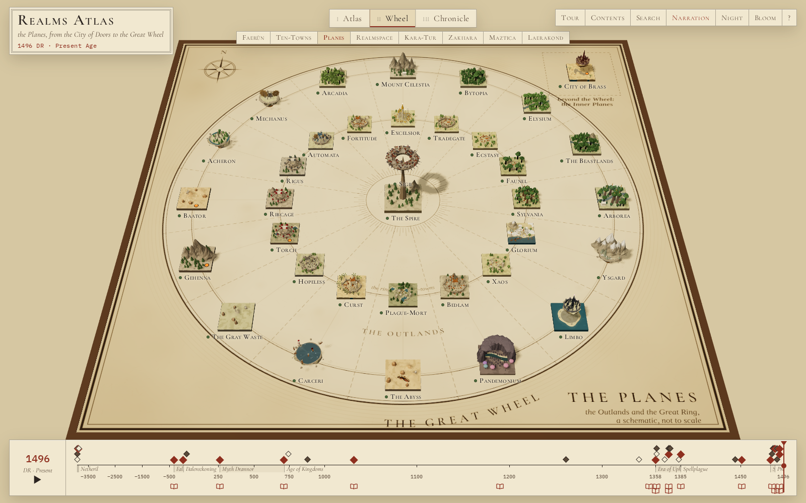
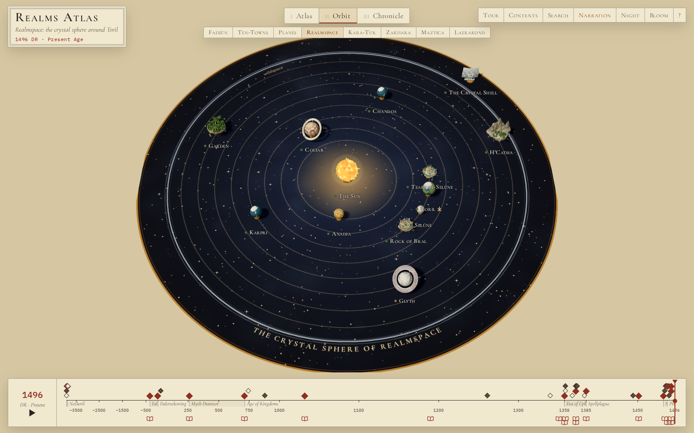
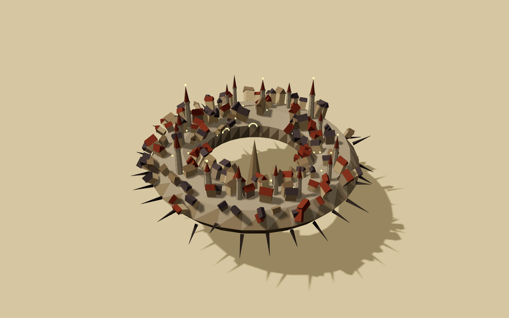
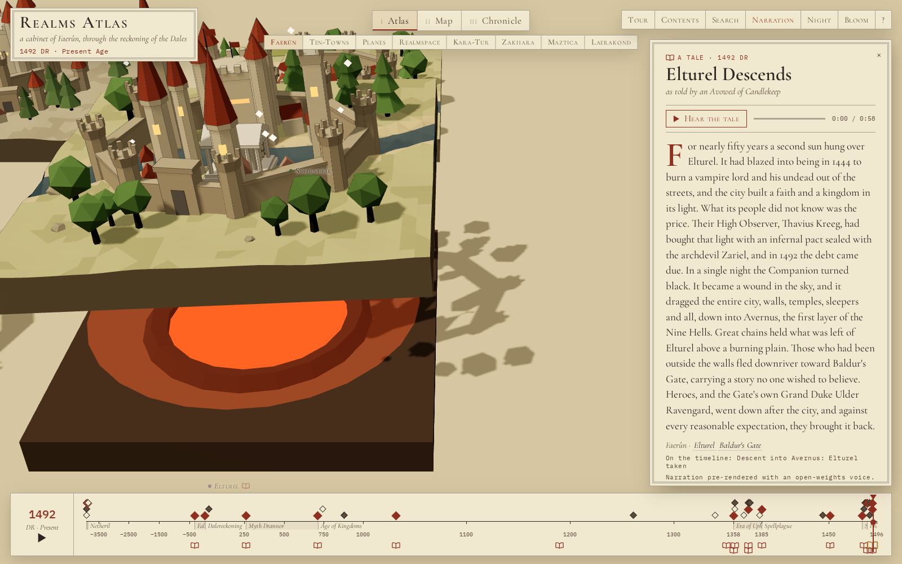

# Realms Atlas

An explorable three.js cabinet of Forgotten Realms cities, towns and landmarks — ninety-one in Faerûn and a
hundred more across seven other boards (Ten-Towns, the Planes, Realmspace, Kara-Tur, Zakhara, Maztica,
Laerakond) — with a Dalereckoning (DR) time scrubber that shows them changing from the Days of Thunder to
1496 DR, and seventeen tales read aloud at the moments that changed them.

Every place is a small procedural **diorama** built in code from one shared low-poly kit — walls, towers,
spires, domes, minarets, keeps, house clusters, trees, mountains, caverns, ships, bridges, ruins, glows —
coloured by the place's own palette. The dioramas sit on a board that rearranges itself into three layouts,
and each one changes with the year: it rises from the board when founded, crumbles when ruined, scorches when
destroyed, fades when abandoned, turns ghostly when hidden, and lifts away when relocated.


| | |
|---|---|
|  |  |
|  |  |

```sh
npm install
npm run data      # validate + merge data/ into src/generated/ (runs automatically before dev/build)
npm run dev       # http://127.0.0.1:5280
npm run build     # static site in dist/ (relative paths: works on GitHub Pages or as an artifact)
npm run preview   # serve dist/
npm run shots     # build, then capture docs/shots/*.png with headless Chromium
```

Node 22+. `npx playwright install chromium` once before `npm run shots`.

## What is in it

- **Atlas** — places grouped by region in columns.
- **Map** — every diorama at its spot on a parchment chart of Faerûn drawn in code from `data/map.json`
  (coastlines with water-lines, mountain hatching, forest and desert marks, lettering, compass). Near-identical
  coordinates are nudged apart and tied to their true spot with a leader line.
- **Chronicle** — places in order of founding, one row per era.
- **Time** — a piecewise-linear scrubber (−3900…0 compressed, 0…1000, 1000…1496 widest) with era bands and world
  events from `data/timeline.json`. Clicking an event jumps to its year and makes the affected dioramas pulse.
  Play runs through all of history in about fifty seconds.
- **Panel** — name, aliases, region, type, population, ruler, an original description, the place's status and
  events on the same time axis, and source links.
- **Tour**, **Contents**, **Search**, **Night** (lantern-lit blue), optional **Bloom** for glowing things,
  deep links, tooltips.

## Worlds

The switcher under the layout tabs swaps the whole board (a short fade, then the camera re-frames). Only the
active world's dioramas are in the scene; a world is built on first visit and kept.

| world | board | its own layout (key `2`) |
|---|---|---|
| **Faerûn** | the parchment chart of `data/map.json` | Map |
| **Ten-Towns** | a chart of Icewind Dale (`data/maps/ten-towns.json`) — a drill-in from Bryn Shander | Map |
| **The Planes** | the Outlands: concentric ink rings and spokes; Sigil, a ring city, hangs on the Spire's needle at the centre; the sixteen gate-towns on the inner ring at their `ring.order`, each Outer Plane on the outer ring at the same angle; the City of Brass off the Wheel in a corner | **Wheel** |
| **Realmspace** | an orrery: the sun at the centre, each body on a faint ink circle at `orbit.radius`, satellites (`satelliteOf`) set along their primary's orbit, a star-pricked deep-blue plate with the crystal shell as its rim; the bodies drift slowly round | **Orbit** |
| **Kara-Tur**, **Zakhara**, **Maztica**, **Laerakond** | their own parchment charts (`data/maps/<world>.json`) | Map |

Atlas and Chronicle work in every world (the Chronicle is per world: the scrubber is global, and every place in
every world resolves its state at the current year). A place with `drill` shows **⤓ Enter Ten-Towns** in its
panel and tooltip (double-click or `Enter` also goes in); Realmspace's Toril drills back to Faerûn. Search and
Contents span all worlds; picking a place in another world switches to it. `#ps-sigil` implies its world.

New looks are chosen by motif as much as by archetype: `ring-city` (Sigil's torus with its blades and doors),
`sphere` / `gas-giant` / `rings` (faceted worlds on brass orrery stands; the sun glows, the crystal shell is a
curved crystal wall with a portal), `asteroid` / `station` (and anything else in Realmspace, or a floating
plane) become a round rock adrift carrying the archetype's town, `gears` (interlocking, turning), `chasm` (a rift
with a fire-glow), `ice` (floes on water, a glacier on land).

## Narration

`data/stories.json` holds seventeen tales (120–180 words each, told by an Avowed of Candlekeep) tied to the
events that shaped the Realms. An open-book glyph marks each tale on the scrubber and on the labels of the
places it touches; the panel lists a place's tales. A **Tale** card shows the title, year and text (drop cap)
with **Hear the tale** and a progress bar. Playing a tale jumps the year, flies to its first place (switching
world if need be) and pulses the others.

Audio is the pre-rendered clip `public/narration/<id>.mp3` (regenerate with `scripts/tts.py`) through an
`<audio>` element; when a tale has no clip, or it fails to load, the browser's `speechSynthesis` reads the text
(an en-GB voice if one is installed). Nothing is spoken before the first click or key press on the page.
The **Narration** toggle in the top bar (remembered in `localStorage`) decides whether the **Tour** stops at a
place's tale, sets the year and reads it before moving on. `prefers-reduced-motion` turns camera flights,
layout animation and the orrery's drift into cuts.

## Controls

| key | |
|---|---|
| `←` `→` | previous / next place (in the current layout's order) |
| `1` `2` `3` | Atlas · Map (Wheel in the Planes, Orbit in Realmspace) · Chronicle |
| `W` / `⇧W` | next / previous world |
| `Enter` | enter the world a focused place opens onto (Bryn Shander → Ten-Towns) |
| `S` | the tales |
| `P` | play / pause the open tale |
| `R` | narration on / off |
| `Space` | play / pause time |
| `[` `]` | previous / next world event |
| `T` | tour (tells the tales on the way when narration is on) |
| `C` | contents |
| `/` | search |
| `N` | night |
| `B` | bloom |
| `H` | hide the interface |
| `Esc` | close the tale / back to the board |
| `?` | keys |

Mouse: drag to orbit, right-drag to pan, wheel to zoom, click a diorama to visit it, double-click a place with
a ⤓ to enter its world.

Deep links: `#waterdeep` opens a place (in its own world: `#ps-sigil` opens the Planes), `?world=realmspace`
opens a world, `?year=1358` sets the year, `?layout=map|wheel|orbit|atlas|chronicle`, `?night=1`,
`?tale=karsus-folly` opens a tale, `?solo=menzoberranzan` shows one diorama alone (add `&view=side|top`),
`?ui=0` hides the interface.

## How it is built

```
data/places/*.json  data/timeline.json  data/map.json     source data (one file per Faerûn region,
data/worlds.json  data/maps/<world>.json                   one per other world: data/places/<world>.json)
data/stories.json  public/narration/*.mp3                  tales and their clips
scripts/schema.mjs        validators for places (world, drill, ring, orbit, satelliteOf), timeline, stories
scripts/build-data.mjs    validate + merge every world → src/generated/{places,timeline,maps,stories}.json
                          (bad records are skipped and listed in docs/DATA-ERRORS.md; data is never edited;
                          other worlds are lenient: an unknown type/archetype/terrain is a warning + fallback)
scripts/check-states.mjs  every place of every world at probe years vs. an independent reading of its status
scripts/stub-data.mjs     placeholder records (npm run data -- --stub; --world planes stubs one missing world)
scripts/tts.py            regenerate the narration clips from data/stories.json
scripts/screenshot.mjs    Playwright screenshots
src/kit/                  the shared architecture kit: Builder (merges geometry per layer × material),
                          instancing prototypes, materials with per-diorama status uniforms, palette, Site
                          (terrain height function + occupancy grid), pieces.js (every architectural piece)
src/kit/cosmos.js         phase-2 pieces: gears, chasms, ice, faceted spheres, rings, floating rock tiles, orreries
src/archetypes/           one generator per archetype (23 + ring-city, celestial-body, island-keep), composing kit pieces
                          from visual.motifs/terrain/scale; index.js picks motif-driven looks and adrift tiles
src/diorama.js            the status machinery: setYear() → tweened rise / collapse / scorch / fade / ghost / lift
src/layouts/              atlas, map, chronicle, wheel (the Planes), orbit (Realmspace)
src/board.js              floor, frames, and each world's board: parchment chart, Outlands wheel, orrery plate
src/worlds.js             worlds, which places and tales belong where, each world's own layout
src/time.js               the DR axis, eras, status lookup
src/ui/                   scrubber, panel, overlays, labels, tale.js (Tale card, narrator, stories index)
src/main.js               renderer, camera, worlds, layouts, tour, narration, keys, URL state
```

Each diorama is a handful of draw calls: geometry is merged per *layer* (base, land, low, tall, ruin, glow,
water, aura) and material, houses and trees are instanced, ink outlines and small animated pieces drop out
when the camera is far, the shadow map is only re-rendered when something moves, and a frame-rate governor
lowers the pixel ratio on slow GPUs. The status system works by scaling layers (towers in `tall` collapse when
a place is ruined; a pre-built `ruin` layer of stumps and rubble rises), and by shader uniforms
(desaturate, scorch, fade, glow, pulse) on cloned materials that share one program.

## Adding a place

1. Add a record to the right `data/places/<region>.json` (or `data/places/<world>.json`; see `docs/SPEC.md` and
   `docs/SPEC-2.md`): id, name, region,
   type, `archetype` (one of the 23, or `island-keep`), `founded`, a `status` timeline, 3–6 `events`, an original `description`,
   `visual` (`palette`, `scale` 1–5, `motifs`, `terrain`, `notes`) and `sources`.
2. Add its coordinates to `places` in `data/map.json` or `data/maps/<world>.json` (see `docs/MAP.md`); the Planes
   use `ring: {order, plane}` and Realmspace `orbit: {index, radius}` instead.
3. Optionally add it to `scripts/roster.mjs` so missing-record checks know about it.
4. `npm run data` — fix anything it reports — then `npm run dev` and open `#your-id` or `?solo=your-id`.

A new look is a new file in `src/archetypes/` registered in `src/archetypes/index.js`; most looks only need
motifs, which `decorate()` in `src/archetypes/common.js` already understands.

A new tale is a record in `data/stories.json` (id, title, year, worldId, placeIds, eventTitle, narrator, text,
`audio: "narration/<id>.mp3"` or null, durationSec); without a clip the browser reads it.

## Deploying

`.github/workflows/pages.yml` builds and publishes the site on every push to `master`.

1. Push this repo to GitHub (e.g. `realms-atlas`).
2. In the repo's **Settings → Pages**, set **Source** to **GitHub Actions**.
3. The site is served at `https://<user>.github.io/realms-atlas/` (the build uses relative paths, so any
   repo name works).

## Attribution

- Facts are drawn from the **Forgotten Realms Wiki** (https://forgottenrealms.fandom.com), licensed
  **CC BY-SA 3.0**; each place lists the pages it was drawn from. All descriptions and tales are original
  prose. No official maps or artwork are used; every chart, the Wheel and the orrery are our own schematic
  drawings.
- *Forgotten Realms*, *Dungeons & Dragons* and related names are trademarks of Wizards of the Coast. This is an
  unofficial fan project, not affiliated with or endorsed by Wizards of the Coast.
- Inspired by Piotr Migdał's **Invisible Cities** atlas
  (https://p.migdal.pl/invisible-cities-opus-5.5/, code: https://github.com/stared/invisible-cities-opus-5.5) —
  the idea of a board of procedural dioramas from one shared kit, animated layouts, tour mode and deep links.
  No code was copied.
- Fonts: Cormorant Garamond and IBM Plex Mono (SIL Open Font License), bundled via Fontsource.
