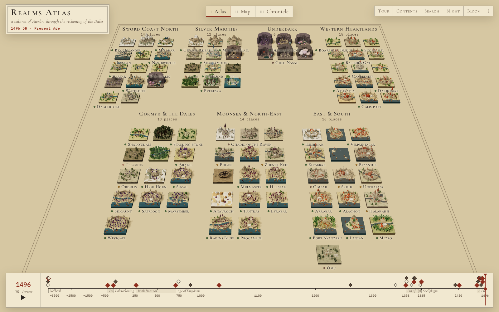

# Realms Atlas

An explorable three.js cabinet of ninety Forgotten Realms cities, towns and landmarks, with a
Dalereckoning (DR) time scrubber that shows Faerûn changing from the Days of Thunder to 1496 DR.

Every place is a small procedural **diorama** built in code from one shared low-poly kit — walls, towers,
spires, domes, minarets, keeps, house clusters, trees, mountains, caverns, ships, bridges, ruins, glows —
coloured by the place's own palette. The dioramas sit on a board that rearranges itself into three layouts,
and each one changes with the year: it rises from the board when founded, crumbles when ruined, scorches when
destroyed, fades when abandoned, turns ghostly when hidden, and lifts away when relocated.



```sh
npm install
npm run data      # validate + merge data/ into src/generated/ (runs automatically before dev/build)
npm run dev       # http://127.0.0.1:5280
npm run build     # static site in dist/ (relative paths: works on GitHub Pages or as an artifact)
npm run preview   # serve dist/
npm run shots     # build, then capture docs/shots/*.png with headless Chromium
```

Node 22+. `npx playwright install chromium` once before `npm run shots`.

## What is in it

- **Atlas** — places grouped by region in columns.
- **Map** — every diorama at its spot on a parchment chart of Faerûn drawn in code from `data/map.json`
  (coastlines with water-lines, mountain hatching, forest and desert marks, lettering, compass). Near-identical
  coordinates are nudged apart and tied to their true spot with a leader line.
- **Chronicle** — places in order of founding, one row per era.
- **Time** — a piecewise-linear scrubber (−3900…0 compressed, 0…1000, 1000…1496 widest) with era bands and world
  events from `data/timeline.json`. Clicking an event jumps to its year and makes the affected dioramas pulse.
  Play runs through all of history in about fifty seconds.
- **Panel** — name, aliases, region, type, population, ruler, an original description, the place's status and
  events on the same time axis, and source links.
- **Tour**, **Contents**, **Search**, **Night** (lantern-lit blue), optional **Bloom** for glowing things,
  deep links, tooltips.

## Controls

| key | |
|---|---|
| `←` `→` | previous / next place (in the current layout's order) |
| `1` `2` `3` | Atlas · Map · Chronicle |
| `Space` | play / pause time |
| `[` `]` | previous / next world event |
| `T` | tour |
| `C` | contents |
| `/` | search |
| `N` | night |
| `B` | bloom |
| `H` | hide the interface |
| `Esc` | back to the board |
| `?` | keys |

Mouse: drag to orbit, right-drag to pan, wheel to zoom, click a diorama to visit it.

Deep links: `#waterdeep` opens a place, `?year=1358` sets the year, `?layout=map|atlas|chronicle`,
`?night=1`, `?solo=menzoberranzan` shows one diorama alone (add `&view=side|top`), `?ui=0` hides the interface.

## How it is built

```
data/places/*.json  data/timeline.json  data/map.json     source data (one file per region)
scripts/schema.mjs        validators for places, timeline
scripts/build-data.mjs    validate + merge → src/generated/{places,timeline,map}.json
                          (bad records are skipped and listed in docs/DATA-ERRORS.md; data is never edited)
scripts/stub-data.mjs     placeholder records for every roster id (npm run data -- --stub)
scripts/screenshot.mjs    Playwright screenshots
src/kit/                  the shared architecture kit: Builder (merges geometry per layer × material),
                          instancing prototypes, materials with per-diorama status uniforms, palette, Site
                          (terrain height function + occupancy grid), pieces.js (every architectural piece)
src/archetypes/           one generator per archetype (23), composing kit pieces from visual.motifs/terrain/scale
src/diorama.js            the status machinery: setYear() → tweened rise / collapse / scorch / fade / ghost / lift
src/layouts/              atlas, map, chronicle (+ wheel.js, reserved for a Planescape layout)
src/board.js              floor, frames, the parchment map (the only texture in the app)
src/time.js               the DR axis, eras, status lookup
src/ui/                   scrubber, panel, overlays, labels
src/main.js               renderer, camera, layouts, tour, keys, URL state
```

Each diorama is a handful of draw calls: geometry is merged per *layer* (base, land, low, tall, ruin, glow,
water, aura) and material, houses and trees are instanced, ink outlines and small animated pieces drop out
when the camera is far, the shadow map is only re-rendered when something moves, and a frame-rate governor
lowers the pixel ratio on slow GPUs. The status system works by scaling layers (towers in `tall` collapse when
a place is ruined; a pre-built `ruin` layer of stumps and rubble rises), and by shader uniforms
(desaturate, scorch, fade, glow, pulse) on cloned materials that share one program.

## Adding a place

1. Add a record to the right `data/places/<region>.json` (see the schema in `docs/SPEC.md`): id, name, region,
   type, `archetype` (one of the 23), `founded`, a `status` timeline, 3–6 `events`, an original `description`,
   `visual` (`palette`, `scale` 1–5, `motifs`, `terrain`, `notes`) and `sources`.
2. Add its coordinates to `places` in `data/map.json` (see `docs/MAP.md`).
3. Optionally add it to `scripts/roster.mjs` so missing-record checks know about it.
4. `npm run data` — fix anything it reports — then `npm run dev` and open `#your-id` or `?solo=your-id`.

A new look is a new file in `src/archetypes/` registered in `src/archetypes/index.js`; most looks only need
motifs, which `decorate()` in `src/archetypes/common.js` already understands.

## Attribution

- Facts are drawn from the **Forgotten Realms Wiki** (https://forgottenrealms.fandom.com), licensed
  **CC BY-SA 3.0**; each place lists the pages it was drawn from. All descriptions are original paraphrase.
  No official maps or artwork are used; the chart of Faerûn is our own schematic drawing.
- *Forgotten Realms*, *Dungeons & Dragons* and related names are trademarks of Wizards of the Coast. This is an
  unofficial fan project, not affiliated with or endorsed by Wizards of the Coast.
- Inspired by Piotr Migdał's **Invisible Cities** atlas
  (https://p.migdal.pl/invisible-cities-opus-5.5/, code: https://github.com/stared/invisible-cities-opus-5.5) —
  the idea of a board of procedural dioramas from one shared kit, animated layouts, tour mode and deep links.
  No code was copied.
- Fonts: Cormorant Garamond and IBM Plex Mono (SIL Open Font License), bundled via Fontsource.
